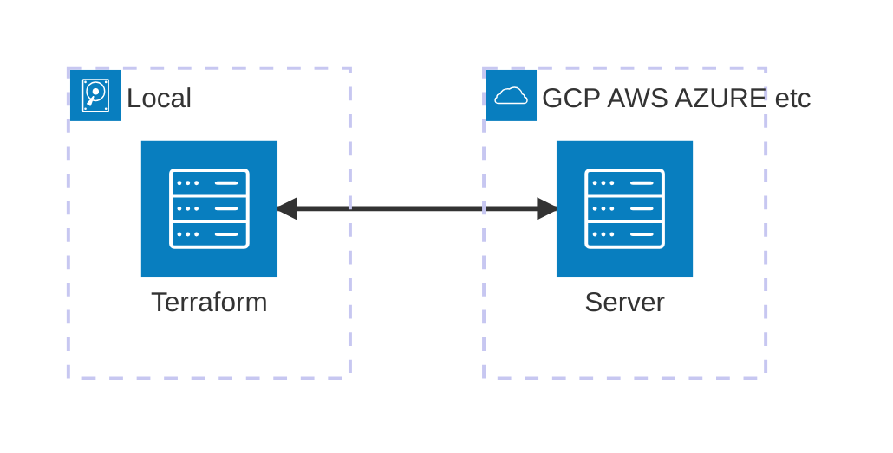

# 1 Docker & Terraform

## 1.2 Docker

### Learning Questions

1. What is docker?
2. Why do we need it?
3. How to run postgres locally with doker
4. How do we put some data for testing into local postgres with Python?
5. How to package this script in docker?
6. How to run postgres and the script in one network?
7. How to compose and run pgadmin and postres together with `docker-compose`?

### [1.2.1 Introduction](https://www.youtube.com/watch?v=EYNwNlOrpr0&list=PL3MmuxUbc_hJed7dXYoJw8DoCuVHhGEQb&index=5)

#### Docker

-   Docker is a program that allows you to install and run programs within it in a compartmentalized fashion.
-   You can save the environment as images which allow you to easily save and redeploy the same setup across different environments (e.g. Cloud, quality, production, etc.)
-   Allows you to reproduce and test pipelines easily without affecting the live instance
-   To exit Python in Docker, press `ctrl+D`
-   To install a Python module in docker, you must enter python with bash
    -   `docker run -it --entrypoint=bash python:3.9`
-   When starting the Python container again, it will not have our previously imported libraries by default
    -   It gets the previous state
-   Build image with `docker build -t <IMAGE:VERSION> .`
    -   `dockerfil` will have the setup instructions
-   Run specific image with `docker run -it <IMAGE:VERSION>`
    -   `-it` allows the container to be stopped

#### [1.2.2 Ingesting NY Taxi Data to Postgres](https://www.youtube.com/watch?v=2JM-ziJt0WI&list=PL3MmuxUbc_hJed7dXYoJw8DoCuVHhGEQb&index=7)

-   install postgress via docker, based off the [yaml](https://hub.docker.com/_/postgres)

```bash
docker run -it \
    -e POSTGRES_USER="root" \
    -e POSTGRES_PASSWORD="root" \
    -e POSTGRES_DB="ny_taxi" \
    -v ny_taxi_postgres_data:{PATH_PROJECT}/data-engineering-zoomcamp/project/ny_taxi_postgres_data \
    -p 5432:5432 \
    postgres:13
```

-   `pgcli` accesses postgres via a CLI
    -   connect via `pgcli -h localhost -p 5432 -u root -d ny_taxi`
-   grab the Yellow Taxi data with `wget`
    -   `wget https://github.com/DataTalksClub/nyc-tlc-data/releases/download/yellow/yellow_tripdata_2021-01.csv.gz`
-   find docker containers with `docker ps`

#### [1.2.3 Connecting `pgAdmin` and Postgres](https://www.youtube.com/watch?v=hCAIVe9N0ow&list=PL3MmuxUbc_hJed7dXYoJw8DoCuVHhGEQb&index=7)

-   Get pgAdmin
    -   `docker pull dpage/pgadmin4`
    -   use `ctrl+c` to quit

```bash
docker run -it \
    -e PGADMIN_DEFAULT_EMAIL="admin@admin.com" \
    -e PGADMIN_DEFAULT_PASSWORD="root" \
    -p 8080:80 \
    dpage/pgadmin4
```

-   how do we connect localhost and container?
    -   put them in the same network
        -   `docker network create pg-network`

```bash
docker run -it \
    -e POSTGRES_USER="root" \
    -e POSTGRES_PASSWORD="root" \
    -e POSTGRES_DB="ny_taxi" \
    -v ny_taxi_postgres_data:{PATH_PROJECT}/data-engineering-zoomcamp/project/ny_taxi_postgres_data \
    -p 5432:5432 \
    --network=pg-network \
    --name pg-database \
    postgres:13
```

```bash
docker run -it \
    -e PGADMIN_DEFAULT_EMAIL="admin@admin.com" \
    -e PGADMIN_DEFAULT_PASSWORD="root" \
    -p 8080:80 \
    --network=pg-network \
    --name pgadmin \
    dpage/pgadmin4
```

-   you can remove containers with `docker rm <CONTAINER>`

#### [1.2.4 Dockerizing the Ingestion Script](https://www.youtube.com/watch?v=B1WwATwf-vY&list=PL3MmuxUbc_hJed7dXYoJw8DoCuVHhGEQb&index=8)

-   Convert Jupyter Notebooks to Python with
    -   `jupyter nbconvert --to=script ny_taxi_csv.ipynb`
-   toggle between overwrite/insert mode with `INSERT`
-   force pip install in a specific python environment
    -   `PATH/TO/PYTHON -m pip install <PACKAGE>`
-   specify params for python

```bash
URL="https://github.com/DataTalksClub/nyc-tlc-data/releases/download/yellow/yellow_tripdata_2021-01.csv.gz"

python3 data_ingest.py \
    --user=root \
    --pasw=root \
    --host=localhost \
    --port=5432 \
    --db=ny_taxi \
    --tble=yellow_taxi_trips \
    --url=${URL}
```

-   update docker container

```bash
docker build -t taxi_ingest:v001 .
```

-   load in docker

```bash
docker run -it \
    --network=pg-network \
    taxi_ingest:v001 \
        --user=root \
        --pasw=root \
        --host=pg-database \
        --port=5432 \
        --db=ny_taxi \
        --tble=yellow_taxi_trips \
        --url=${URL}
```

-   launcg HTTP server via Python
    -   `python -m http.server`

#### [1.2.5 Running Postgres and pgAdmin with Docker-Compose](https://www.youtube.com/watch?v=hKI6PkPhpa0&list=PL3MmuxUbc_hJed7dXYoJw8DoCuVHhGEQb&index=9)

-   manual docker-compose install required on linux
-   setup containers from docker-compose file
    -   `docker-compose up`
-   shutdown docker-compose
    -   `docker-compose down`

#### [1.2.6 SQL Refresher](https://www.youtube.com/watch?v=QEcps_iskgg&list=PL3MmuxUbc_hJed7dXYoJw8DoCuVHhGEQb&index=10)

-   Drop time from a DATETIME
    -   `DATE_TRUNC('DAY', DATETIME_COLUMN)`

#### [1.3.1 Terraform Primer](https://www.youtube.com/watch?v=s2bOYDCKl_M&list=PL3MmuxUbc_hJed7dXYoJw8DoCuVHhGEQb&index=11)

##### Concept

-   Infrastructure as code

##### Usage

-   Easy readability
-   Easier collaboration
-   Reproducability
-   Ensure resources are removed
    -   Don't need to remember everything you installed

##### What is it not?

-   Does not manage or update code
-   Not made to deploy software
-   Does not allow you to channge immutable resources
-   Not used to manage resources not defined in the terraform files

##### What it is?

-   Infrastructure as code

##### Providers?

-   Platform connectors



##### Commands

-   all are preceeded by `terraform`
    -   [install info](https://developer.hashicorp.com/terraform/install)
-   `fmt`
    -   Formats the code
-   `init`
    -   Get the required providers to your local machine
-   `plan`
    -   Shows what you are about to do
-   `apply`
    -   Do what is in the `.tf` file
-   `destroy`
    -   Get rid of everything that was defined in the `.tf` file
-   Always use `yes` to confirm `apply` or `destroy` commands
-   Apply variable file with `terraform <COMMAND> -var-file="<FILENAME>.tfvars"`

##### Additional information

#### [1.3.2 Terraform Basics](https://www.youtube.com/watch?v=Y2ux7gq3Z0o&list=PL3MmuxUbc_hJed7dXYoJw8DoCuVHhGEQb&index=12)

-   Use Service Accounts as pseudo users where you never have to log in
-   Always grant least required rights

##### Terraform

| File Extension | Usage                                     |
| -------------- | ----------------------------------------- |
| `.tf`          | where you define your terraform bucket    |
| `.tfvars`      | Where you can define many variables       |
| `.tfstate`     | where you see the setup of your terraform |

#### [1.3.2 Terraform Basics](https://www.youtube.com/watch?v=PBi0hHjLftk&list=PL3MmuxUbc_hJed7dXYoJw8DoCuVHhGEQb&index=13)

-   `unset`
    -   removes set variables

#### [1.4.1 Setting up the Environment non Google Cloud (Cloud VM + SSH access)](https://www.youtube.com/watch?v=ae-CV2KfoN0&list=PL3MmuxUbc_hJed7dXYoJw8DoCuVHhGEQb&index=14)
